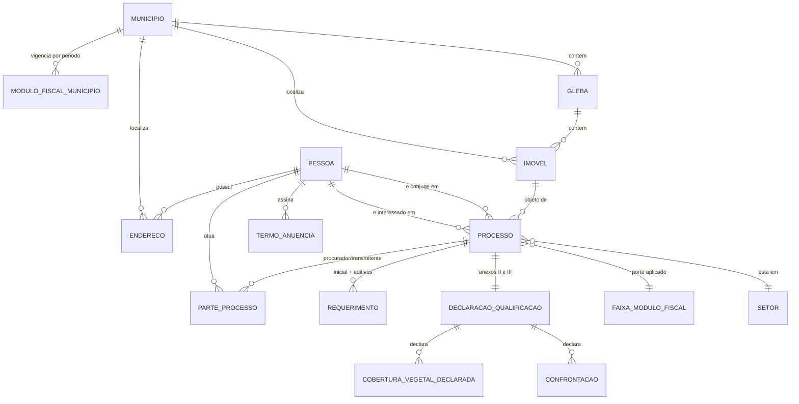
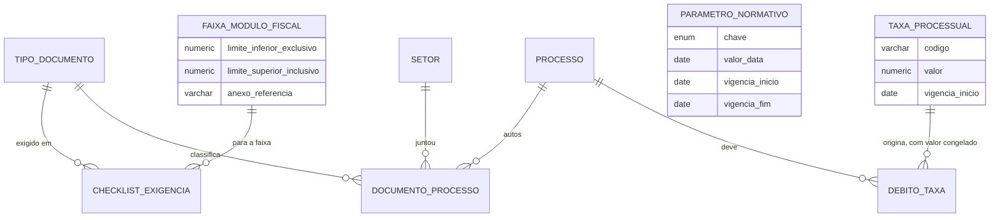
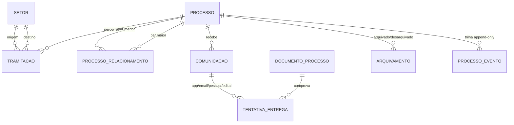

# Modelo de domínio — Núcleo processual da IN nº 002/2026

Modelagem para o `api-titula-rr` (NestJS + Prisma 7 + PostgreSQL 16 + PostGIS 3.4), na convenção de nomes do projeto — colunas camelCase, tabelas em plural português, enums PascalCase — cobrindo o núcleo processual da Instrução Normativa nº 002/2026 do ITERAIMA: requerimento, partes, imóvel, declarações, documentos, tramitação entre setores e comunicações.

Arquivos que acompanham este documento:

- `prisma/schema.prisma` — 29 models e 23 enums
- `prisma/migrations/20260825_in002_nucleo_processual/migration.sql` — DDL completo, incluindo o que o Prisma não expressa
- `prisma/seed/feriados.sql` — calendário de feriados de RR e Boa Vista, 2026-2036
- `.../verifica_regras.sql`, `.../verifica_lacunas.sql` e `.../verifica_financeiro.sql` — scripts que provam as constraints

**Estado de validação:** o DDL foi aplicado sem erro contra PostgreSQL 16 + PostGIS 3.4.2, as constraints de negócio foram testadas com dados (todas rejeitaram os casos inválidos), e cada campo do `schema.prisma` foi conferido contra as colunas realmente criadas — 29 models ↔ 29 tabelas, 23 enums ↔ 23 tipos, sem divergência. O `prisma validate` **não** pôde ser executado: o host de binários do Prisma (`binaries.prisma.sh`) responde 403 no ambiente de análise. Rode `npx prisma validate` na sua máquina antes de aplicar.

---

## 1. Escopo

**Dentro:** Capítulos II (requerimento e instrução), III (relacionamento de processos), X (Câmara de Notificação), parte do XII (intimação eletrônica, arquivamento), Anexos I, II, III, VII, VIII, IX, X e XIII.

**Fora desta rodada,** por decisão de escopo — cada um encaixa no núcleo sem alterá-lo:

| Domínio                                                 | Capítulo / Anexo        | Onde encaixa                                                                                     |
| ------------------------------------------------------- | ----------------------- | ------------------------------------------------------------------------------------------------ |
| Sobreposição e produtos cartográficos                   | Cap. IV (Arts. 16-31)   | Novos models pendurados em `Processo` e `Imovel`; a geometria já está pronta                     |
| Georreferenciamento e SIGEF                             | Cap. V (Arts. 32-36)    | `Imovel.codigoParcelaSigef` já existe como âncora                                                |
| Vistoria e laudo                                        | Cap. VI (Arts. 37-42)   | Novo model ligado a `Processo`, com validade parametrizada                                       |
| Conflito agrário                                        | Cap. VII (Arts. 43-46)  | `Processo.situacao = EM_CONFLITO` já previsto                                                    |
| VTN, título, parcelas, descontos, cláusulas resolutivas | Cap. VIII/IX, Anexo XII | Fases `APURACAO_VTN` em diante já no enum; `DebitoTaxa` já cobre as taxas processuais da etapa 1 |
| Desarquivamento                                         | Cap. XI (Arts. 55-58)   | `Arquivamento.desarquivadoEm` já é o gancho                                                      |

---

## 2. Diagrama de entidades

### 2.1 Pessoas, imóvel e processo



### 2.2 Documentos, checklist e parâmetros



### 2.3 Tramitação, comunicação e auditoria



---

## 3. Decisões de normalização

### 3.1 Primeira forma normal — grupos repetitivos dos formulários

Os anexos da IN são formulários de papel, e trazem grupos repetitivos que não podem virar colunas:

- **Confrontações (Anexo III).** O formulário tem quatro linhas fixas — Norte, Sul, Leste, Oeste. Viraram a tabela `confrontacoes`, com `rumo` como enum e `ordem` como discriminador, porque na prática um mesmo rumo pode ter vários confrontantes. Quatro colunas `confrontacao_norte`, `confrontacao_sul`… tornariam impossível registrar isso.
- **Cobertura vegetal (Anexo II).** O formulário tem Cerrado e Floresta, cada um com área, área de RL e percentual — nove colunas repetidas. Viraram `coberturas_vegetais`, com `UNIQUE ("declaracaoId", tipo)`. Ganho colateral: se a norma acrescentar uma tipologia (campinarana, savana), é uma linha de enum, não uma migração de tabela.

### 3.2 Segunda e terceira formas normais — fato declarado ≠ atributo do bem

A decisão estrutural mais importante do modelo: **as características do imóvel declaradas no Anexo II não são atributos do imóvel.**

Eletrificação rural, acesso rodoviário, edificações, criações, cultura efetiva, recuperação de área degradada — tudo isso é afirmação do requerente, assinada sob o art. 299 do Código Penal, numa data específica. Se ficassem em `imoveis`, um segundo processo sobre o mesmo imóvel sobrescreveria as declarações do primeiro e destruiria a prova. Ficaram em `declaracoes_qualificacao`, com dependência funcional do processo — não do imóvel.

`imoveis` guarda apenas identidade estável: denominação, município, gleba, códigos de registro (SNCR, CCIR, SIGEF, matrícula) e perímetro.

### 3.3 Terceira forma normal — dependência transitiva do módulo fiscal

O módulo fiscal não é atributo do município: é valor fixado pelo INCRA **para** o município, com vigência. Guardá-lo em `municipios."moduloFiscalHa"` seria dependência transitiva e, pior, apagaria o histórico — e o Art. 51 manda verificar os requisitos "da lei à época da emissão do TD".

Virou `modulos_fiscais` com `vigenciaInicio`/`vigenciaFim` e uma EXCLUDE constraint que impede vigências sobrepostas para o mesmo município.

### 3.4 Denormalizações deliberadas

Seis campos são derivados e ainda assim armazenados. Nenhum é descuido:

| Campo                                | Derivado de                                     | Por que é gravado                                                                                                                 |
| ------------------------------------ | ----------------------------------------------- | --------------------------------------------------------------------------------------------------------------------------------- |
| `processos."numeroModulosFiscais"`   | `imovel.area / modulo_fiscal.hectares`          | O módulo fiscal muda por norma do INCRA. Recalcular depois daria um número diferente do que fundamentou a decisão                 |
| `processos."moduloFiscalAplicadoHa"` | `modulos_fiscais`                               | Registra o divisor efetivamente usado                                                                                             |
| `processos."marcoTemporalAplicado"`  | `parametros_normativos`                         | A IN traz 17/11/2017 (Art. 11 §1º) e 19/11/2017 (Anexo II). Sem gravar, não há como auditar qual critério cada processo respondeu |
| `comunicacoes."dataCienciaEfetiva"`  | `max(tentativa_entrega.confirmada_em)`          | O Art. 71, III manda valer a data que ocorrer por último; o prazo processual precisa de data fixa, não recalculada                |
| `debitos_taxa.valor`                 | `taxas_processuais.valor` vigente               | A taxa é reajustada por lei; o boleto já emitido não muda de valor                                                                |
| `processos."setorAtualId"`           | última `tramitacoes` com `concluido_em IS NULL` | Listagem de processos por setor é a consulta mais frequente do sistema; derivar em toda página custaria um LATERAL por linha      |

Os cinco primeiros seguem o mesmo padrão: **snapshot temporal de uma regra que muda**. Não são cache de performance — são prova de qual norma foi aplicada.

`processos."setorAtualId"` é de natureza diferente dos demais — é cache de leitura, não prova. Por isso carrega uma invariante: **ele e a `tramitacoes` aberta são atualizados sempre na mesma transação**, no `TramitacaoModule`. Se divergirem, a `tramitacoes` é a verdade.

### 3.5 Par não ordenado em `processos_relacionamentos`

Relacionamento entre processos é simétrico: se A se relaciona com B, B se relaciona com A. Sem cuidado, o banco aceita as duas linhas e a contagem de sobreposições fica errada.

A solução é canonizar o par: `CHECK (processo_menor_id < processo_maior_id)` mais `UNIQUE (menor, maior, motivo)`. Só uma das direções é gravável, e o `UNIQUE` fecha a duplicata. A aplicação sempre ordena os ids antes do insert.

---

## 4. Onde cada regra mora — a decisão mista

**No código (enum do Prisma):** o que é estrutura do domínio e só muda com mudança de software. Fases do processo, tipos de pessoa, meios de comunicação, rumos de confrontação, motivos de relacionamento. Erro não compila, mudança é commit auditável — a mesma lógica já adotada na matriz papel→permissão.

**No banco (tabela com vigência):** o que muda por lei, errata ou ato do INCRA, e cujo valor histórico precisa sobreviver.

| Tabela                  | O que guarda                                                                      | Fundamento                              |
| ----------------------- | --------------------------------------------------------------------------------- | --------------------------------------- |
| `parametros_normativos` | Marco temporal, prazos de validade das peças, limite constitucional, SRID oficial | Arts. 11, 19, 38, 49                    |
| `faixas_modulo_fiscal`  | Faixas de porte e o anexo de checklist correspondente                             | Arts. 10, 11, 12                        |
| `modulos_fiscais`       | Hectares por módulo, por município                                                | INCRA                                   |
| `taxas_processuais`     | Taxas de abertura, desarquivamento, vistoria                                      | Lei 1.252/2018 alterada pela 2.317/2025 |
| `checklist_exigencias`  | Quais documentos, em qual faixa, com qual obrigatoriedade                         | Art. 6º ∪ Anexos VII-IX                 |
| `setores`               | Unidades do fluxo do Anexo X                                                      | Estrutura organizacional                |

Nenhuma dessas admite vigências sobrepostas — todas têm EXCLUDE constraint com `daterange`.

---

## 5. Como o modelo trata as inconsistências da IN

O levantamento anterior identificou dezessete inconsistências. Sete delas afetam diretamente a modelagem, e cada uma tem um mecanismo:

| Inconsistência da IN                                                     | Mecanismo no banco                                                                                                                                                                                                                                                  |
| ------------------------------------------------------------------------ | ------------------------------------------------------------------------------------------------------------------------------------------------------------------------------------------------------------------------------------------------------------------- |
| Marco temporal 17/11/2017 (Art. 11 §1º) vs 19/11/2017 (Anexo II)         | Valor único em `parametros_normativos` com vigência; `declaracao."marcoTemporalReferencia"` e `processos."marcoTemporalAplicado"` gravam o que foi aplicado. Quando houver errata, é UPDATE — e os processos antigos continuam mostrando o critério que responderam |
| Faixas de módulo fiscal sobrepostas (Art. 10 "até 1" vs Art. 11 "até 4") | `ex_faixa_sem_sobreposicao` — EXCLUDE com `numrange` + `daterange`. O banco **recusa** cadastrar faixas que se sobreponham. A leitura adotada segue o título do Anexo VIII: `(0,1]`, `(1,4]`, `(4,∞)`                                                               |
| Vazio nos exatos 4 módulos (Art. 49, II, "a")                            | Fechado pela faixa `(1,4]`, que inclui o limite superior                                                                                                                                                                                                            |
| Divergência entre Art. 6º e Anexos VII-IX                                | `checklist_exigencias` é a **união** das duas listas, com `fundamentoLegal` por linha dizendo de onde cada exigência veio                                                                                                                                           |
| Art. 5º pu (vedada duplicidade) sem mecanismo                            | Índice parcial `ux_processo_ativo_por_interessado_imovel` — mesmo interessado + mesmo imóvel só pode ter um processo não encerrado                                                                                                                                  |
| Art. 78 (vedada tramitação simultânea) sem mecanismo                     | Índice parcial `ux_tramitacao_aberta_por_processo` — uma tramitação aberta por processo, garantido pelo banco                                                                                                                                                       |
| Validades descompassadas (parecer 12 meses, laudo 24, autorização 24)    | Cada validade é linha em `parametros_normativos`. O portão de fase compara com a data da peça e recusa avançar com peça vencida                                                                                                                                     |

As duas inconsistências que o banco **não** resolve, e que precisam de decisão jurídica antes de virar código:

- **Rito recursal inexistente** (Art. 59 §2º remete a "câmara recursal" que a IN não institui). Não há como modelar prazo, instância ou efeito. Enquanto não houver definição, `Processo` não ganha fase de recurso.
- **Art. 46 vs Arts. 59/61/64/66** (fluxo obrigatório de conflito vs indeferimento imediato). O modelo prevê `situacao = EM_CONFLITO`, mas qual rito dispara depende de decisão da Presidência, não do schema.

---

## 6. PostGIS

**SRID 4674 (SIRGAS 2000 geográfico)** para armazenamento, conforme o Art. 23. Tipo `geometry(MultiPolygon, 4674)` — o typmod já força SRID e tipo geométrico, dispensando CHECK; `ST_IsValid` cobre o resto. Índice GiST em `imoveis.perimetro` e `glebas.perimetro`.

**Sobre área — o ponto que mais gera erro.** O Art. 23 remete às normas do INCRA quanto ao cálculo em Sistema Geodésico Local. Isso não é UTM nem `ST_Area(geography)`: é um sistema local específico da NTGIR. Logo, **nenhuma área calculada pelo Postgres é oficial**. O modelo separa três:

- `areaDeclaradaHa` — o que o requerente informou no Anexo I
- `areaCertificadaHa` — o que veio da peça técnica certificada. **Esta é a autoritativa**
- **área de triagem** — `ST_Area(perimetro::geography)/10000`, calculada sob demanda pelo `GeoService`. **Não é coluna.** Uma coluna `GENERATED` numa tabela que o Prisma escreve é armadilha: quem a passar em `create` recebe erro `428C9` do Postgres. Serve para triagem — divergência grande contra a declarada é sinal de perímetro errado, não prova de nada

No teste com um polígono de conferência, a declarada (100 ha) e a de triagem (122,95 ha) divergiram em 23 ha — exatamente o tipo de sinal que o cálculo existe para dar.

**Duas armadilhas do Prisma com PostGIS:**

1. `perimetro` é `Unsupported(...)`. O Prisma Client **não consegue selecionar nem gravar** esse campo. Toda leitura e escrita de geometria vai por `$queryRaw` / `$executeRaw` com `ST_GeomFromText`, `ST_AsGeoJSON` etc. Isso não é limitação contornável — é como o Prisma trata tipos que não conhece.
2. Não existe coluna de área calculada — justamente para não deixar essa armadilha no caminho. O `GeoService` calcula na consulta.

---

## 7. O que vive só na migração SQL

O Prisma não expressa nenhum destes. Se você rodar `prisma migrate dev` e deixar o Prisma gerar o SQL sozinho, **todos somem**:

- `CREATE EXTENSION postgis` e `btree_gist`
- Colunas `geometry` operáveis e índices GiST
- **5 EXCLUDE constraints** (vigências e faixas sem sobreposição)
- **11 índices parciais** (Art. 5º pu, Art. 78, requerimento inicial único, parte vigente, termo de anuência vigente, arquivamento vigente, parcela SIGEF única, prazos em aberto, subject gov.br único, credencial ativa única, número de boleto único, débitos em aberto)
- **45 CHECK constraints** (CPF/CNPJ conforme tipo de pessoa, formato de CPF/CEP/hash, coerência de datas, naturalizado com portaria, transmitente obrigatório quando não é ocupante primitivo, etapa do Anexo X entre 1 e 14, escopo do feriado, coerência da credencial, `PAGO` se e somente se houver data de pagamento)
- **4 funções PL/pgSQL** (`pascoa`, `gerar_feriados_moveis`, `e_dia_util`, `adicionar_dias_uteis`)
- `UNIQUE NULLS NOT DISTINCT` em `feriados` — recurso de PG 15+, não expressável no Prisma

Contagem conferida no banco após aplicar a migração: 5 EXCLUDE, 45 CHECK nomeados, 11 índices parciais, 46 chaves estrangeiras (11 delas `RESTRICT` apontando para `processos`) e 4 funções.

O fluxo correto é `npx prisma migrate dev --create-only` e substituir o SQL gerado pelo arquivo da migração.

---

## 7-A. Lacunas fechadas

Três lacunas apareceram ao desenhar os módulos da API e foram resolvidas dentro do mesmo migration de init.

### Calendário de feriados e contagem de dias úteis

O Art. 71 §1º conta cinco dias úteis, e os prazos processuais dependem disso — não havia como computá-los.

A tabela `feriados` tem três abrangências (nacional, estadual, municipal) com CHECK garantindo que o escopo seja coerente: nacional não pode ter UF, estadual precisa ter, municipal precisa de município. `UNIQUE NULLS NOT DISTINCT` impede duplicar o mesmo feriado nacional — em versões anteriores ao PG 15 isso exigiria índice sobre expressão.

Os feriados móveis **não são semeados ano a ano**. A função `pascoa(ano)` implementa o algoritmo gregoriano anônimo (Meeus/Jones/Butcher) e `gerar_feriados_moveis(ano)` deriva Carnaval (−47), Sexta-feira Santa (−2) e Corpus Christi (+60), de forma idempotente. Conferido contra datas conhecidas: 2024 → 31/03, 2025 → 20/04, 2026 → 05/04, 2027 → 28/03.

Duas funções fecham a contagem: `e_dia_util(data, municipio_id)` — segunda a sexta, sem feriado aplicável ao município, ignorando ponto facultativo, que não suspende prazo — e `adicionar_dias_uteis(inicio, dias, municipio_id)`.

O município importa. Contando cinco dias úteis a partir de sexta, 03/07/2026: em Boa Vista o vencimento cai em **13/07**, porque o aniversário do município (09/07) é feriado; sem o município, cairia em **10/07**. Três dias de diferença num prazo de intimação.

O seed cobre 2026 a 2036 com os nacionais fixos (Leis 662/1949, 6.802/1980 e 14.759/2023), os dois estaduais de Roraima — 05/10, aniversário do Estado, e 08/12 — e os dois municipais de Boa Vista — 20/01, São Sebastião, e 09/07, aniversário do município — conferidos no calendário oficial do TJRR. Os demais municípios de RR entram conforme forem cadastrados, com suas leis orgânicas.

### Storage de documentos

O binário nunca vai para o Postgres. `storage_backend` discrimina onde ele vive, com **`LOCAL_FS` como padrão** — suficiente para o volume do Iteraima e o que menos acopla. `S3_COMPATIVEL` e `SEI` existem para que uma eventual troca seja migração de dados, não de schema, e para que documentos de origens diferentes coexistam durante a transição.

No código isso vira um `StorageService` com uma interface e três implementações, no mesmo padrão do `CredentialValidator` que você já usa: a de filesystem entra primeiro, as outras quando houver necessidade.

Junto veio o índice `ux_documento_dedup` sobre `(processo_id, tipo_documento_id, hash_sha256)`: o mesmo arquivo, do mesmo tipo, no mesmo processo é reenvio, não nova juntada. Sem ele, um duplo clique no Portal duplica documento nos autos.

Fica como decisão operacional, não de schema: o diretório base no LXC e sua inclusão na rotina de backup — que precisa cobrir os arquivos, não só o banco.

### Acesso do cidadão ao Portal

O Art. 5º prevê protocolo pelo próprio interessado no Portal Iteraima Cidadão, e a autenticação atual é AD mais break-glass local. O cidadão não tem conta no AD, e criar uma para cada requerente seria poluir o diretório corporativo com dezenas de milhares de contas sem função de rede.

A solução é um **principal separado**: `pessoas_acesso` liga a credencial à `Pessoa`, com origem `GOVBR` (subject do OIDC) ou `LOCAL` (hash argon2, para contingência). O CHECK garante que as duas não coexistam na mesma linha, e um índice parcial garante uma credencial ativa por pessoa — revogar e criar nova é o caminho, preservando o histórico.

**A tabela de autenticação existente não muda.** No `AuthModule`, o cidadão entra como um segundo `CredentialValidator` atrás da interface que já existe — a mesma abstração que hoje separa `FakeAdValidator` de `AdValidator`. O que muda é o guard: o principal passa a carregar sua origem, e o cidadão só enxerga os processos em que é interessado, cônjuge ou parte. Na matriz de RBAC isso é um papel `cidadao` com permissões restritas ao próprio dossiê — não um papel de setor.

Vale registrar o que isso **não** resolve: a integração gov.br exige credenciamento do órgão junto ao provedor e o fluxo OIDC correspondente. O modelo está pronto para receber o `sub`; a habilitação é trâmite administrativo, não código.

---

## 8. Pré-requisitos e riscos de ambiente

**Bloqueante — PostGIS no LXC de produção.** O banco em `20.50.2.224` roda PostgreSQL 16.13 sem PostGIS. Sem a extensão, esta migração não aplica. No Debian/Ubuntu do LXC:

```bash
apt-get install -y postgresql-16-postgis-3 postgresql-16-postgis-3-scripts
# depois, como superusuário no banco titularr:
psql -d titularr -c "CREATE EXTENSION postgis; CREATE EXTENSION btree_gist;"
```

Vale confirmar antes se o repositório do LXC tem o pacote na versão que casa com o PG 16 instalado — PostGIS é sensível a isso, e um upgrade parcial deixa o banco sem abrir.

**Divergência dev/prod.** O `docker-compose.dev` usa `imresamu/postgis:17-3.5` e a produção roda PG 16.13. Duas majors de diferença num banco com tipos geométricos é risco concreto: `pg_dump` de 17 não restaura em 16, e o comportamento de algumas funções PostGIS muda entre 3.4 e 3.5. Recomendo alinhar o dev para `imresamu/postgis:16-3.4` até a produção subir de major. Este DDL foi validado em PG 16 + PostGIS 3.4 — a combinação da produção, não a do dev.

**Backup ainda ausente.** Já estava anotado como bloqueante para produção e vale mais agora: com PostGIS, um `pg_dump` sem `--format=custom` e sem a extensão instalada no destino não restaura. O plano de backup precisa cobrir a extensão, não só os dados.

**Setores sem papel no RBAC.** A tabela `setores` tem `papelRbac` nullable justamente para tornar a lacuna visível. Hoje a **DSF** — presente nas etapas 3, 6 e 13 do Anexo X, o setor mais recorrente do fluxo — não tem papel correspondente na matriz (`atendimento`, `financeiro`, `titulacao`, `informatica`, `planejamento`, `governanca`, `presidencia`, `colaborador`, `gestor`, `administrador`). Ouvidoria Agrária, Câmara de Notificação e Divisão de Arquivo também não. Decidir se é agregação intencional ou lacuna antes de codar o guard de tramitação.

**Chaves para `Usuario`.** Cinco colunas referenciam o servidor responsável (`juntadoPorId`, `servidorRecebId`, `criadoPorId`, `chefiaAprovouId`, `usuarioId`) e estão como `TEXT` sem FK, porque o tipo do id na sua tabela de autenticação não foi confirmado. Assim que confirmar, acrescente as cinco FKs — são cinco `ALTER TABLE`.

---

## 9. Sugestão de sequência

No seu padrão de "cada passo roda e commita":

1. **PostGIS no LXC** + alinhar a major do dev. Sem isso nada avança
2. **Migração + seed** — municípios de RR, módulo fiscal por município, as três faixas, setores, tipos de documento, checklist e o calendário de feriados (`prisma/seed/feriados.sql`). O seed é o que torna o modelo utilizável
3. **CRUD de Processo** com o resolvedor de faixa (a consulta do item 10 do script de verificação já é o algoritmo pronto)
4. **Upload e checklist** — validar juntada contra `checklist_exigencias` vigente
5. **Tramitação** com o guard do Art. 78 e as cinco FKs para `Usuario`
6. **Comunicações** com a regra do Art. 71, III e os prazos em dias úteis

Os itens 2 e 3 são onde o modelo prova que funciona. Depois disso, sobreposição e vistoria entram sem mexer no núcleo.
