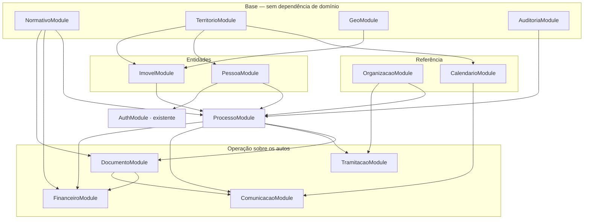

# Módulos do `api-titula-rr` — núcleo processual da IN 002/2026

Arquitetura de módulos NestJS derivada dos 29 models de `prisma/schema.prisma`. Complementa [`modelo-dominio.md`](./modelo-dominio.md), que descreve o modelo de dados. **Nenhum destes módulos existe ainda** — ver o estado em [`README.md`](./README.md).

São **12 módulos novos** e **2 existentes modificados**. A lista cresceu de 9 para 12 ao longo da modelagem: o calendário de feriados e a tabela de setores ganharam fronteira própria ao fechar as lacunas, e o `FinanceiroModule` entrou depois — `TaxaProcessual` estava no schema sem nenhum consumidor.

---

## 1. Visão geral

---

## 2. Os doze módulos

### Base

**`NormativoModule`** — `ParametroNormativo`, `FaixaModuloFiscal`, `TaxaProcessual`, `TipoDocumento`, `ChecklistExigencia`

A metade "banco" da decisão mista sobre onde ficam as regras. Expõe `vigente(chave, data)`, `resolverFaixa(modulos, data)` e `exigenciasDaFaixa(faixaId, data)`. Não depende de ninguém e quase todo mundo depende dele. Cabe cache em memória com TTL curto: são poucas dezenas de linhas, lidas em toda requisição, alteradas por errata.

**`TerritorioModule`** — `Municipio`, `Gleba`, `ModuloFiscalMunicipio`

Referência territorial. O método que importa é `moduloFiscalVigente(municipioId, data)`, o divisor que define a faixa de todo processo.

**`GeoModule`** — nenhum model

Só existe para exportar `GeoService`, e é o **único lugar do projeto com `$queryRaw` de geometria**: `ST_GeomFromGeoJSON`, `ST_AsGeoJSON`, `ST_IsValid`, `ST_Intersects`, `ST_Area`. Como `perimetro` é `Unsupported(...)` e invisível ao Prisma Client, esse SQL cru é inevitável — o que se pode escolher é se ele fica num provider ou espalhado por cinco serviços. Módulo próprio também porque a análise de sobreposição (Cap. IV, próxima fase) vai consumir exatamente isso.

**`AuditoriaModule`** — `ProcessoEvento`

Transversal, não CRUD. Exporta `EventoService.registrar()`, chamado de dentro das transações dos outros módulos. Atende ao Art. 53, V — certificar nos autos todas as ocorrências.

### Referência

**`OrganizacaoModule`** — `Setor`

Os setores do fluxo do Anexo X e a resolução setor → papel de RBAC. É pequeno, mas ganhou fronteira própria por dois motivos: é consumido por quatro módulos diferentes, e é onde mora a decisão pendente sobre a DSF, que aparece nas etapas 3, 6 e 13 do Anexo X sem papel correspondente na matriz.

**`CalendarioModule`** — `Feriado`

Exporta `PrazoService`, com `eDiaUtil(data, municipioId)` e `vencimento(inicio, dias, municipioId)` — wrappers finos sobre as funções `e_dia_util` e `adicionar_dias_uteis` do banco. A contagem fica em SQL porque depende da tabela de feriados; o módulo dá tipagem, cache e testabilidade.

Separado do `NormativoModule` de propósito: parâmetro normativo muda por errata da IN, feriado muda por lei de feriado. Fontes de verdade diferentes, taxas de mudança diferentes.

### Entidades

**`PessoaModule`** — `Pessoa`, `Endereco`, `PessoaAcesso`

CRUD, busca por CPF e as credenciais do cidadão. Aqui mora a regra de LGPD: CPF e CNPJ nunca em log, mascarados na resposta salvo permissão explícita. Exporta `PessoaAcessoService`, que o `AuthModule` consome.

**`ImovelModule`** — `Imovel`

Consome o `GeoService`; nunca toca em `perimetro` direto. Cuida da separação entre área declarada, certificada e calculada, e sinaliza divergência entre a declarada e a de triagem.

### Agregado central

**`ProcessoModule`** — `Processo`, `Requerimento`, `ParteProcesso`, `DeclaracaoQualificacao`, `CoberturaVegetalDeclarada`, `Confrontacao`, `ProcessoRelacionamento`, `Arquivamento`

O maior dos doze, com oito models, e de propósito. Na abertura resolve faixa, módulo fiscal e marco temporal e grava os três snapshots; traduz a violação de `ux_processo_ativo_por_interessado_imovel` (SQLSTATE `23505`) num 409 RFC 7807 que diz qual processo já existe; canoniza o par de ids antes de inserir relacionamento; e controla a máquina de fases.

Declaração, relacionamento e arquivamento entram como **sub-recursos**, não módulos: `/processos/:id/declaracao`, `/processos/:id/relacionamentos`, `/processos/:id/arquivamento`. São 1:1 ou 1:N estreitos com o processo, e módulo próprio para cada um só adicionaria imports. Se a declaração virar vários tipos, aí sim se separa.

### Operação sobre os autos

**`DocumentoModule`** — `DocumentoProcesso`

Upload, SHA-256, e validação da juntada contra o `ChecklistExigencia` vigente para a faixa do processo. Traduz a violação de `ux_documento_dedup` em "documento já juntado", não em erro 500.

Contém o `StorageService` como **provider interno**, com interface e a implementação de filesystem — no mesmo padrão do `CredentialValidator`. Não virou módulo próprio como o `GeoModule` porque só este módulo o consome; se algum dia outro precisar, promove-se.

**`TramitacaoModule`** — `Tramitacao`

Guard do Art. 78 e movimentação de `setorAtualId` e `faseAtual` na mesma transação. A violação de `ux_tramitacao_aberta_por_processo` vira um 409 explicando em que setor o processo já está.

**`ComunicacaoModule`** — `Comunicacao`, `TentativaEntrega`, `TermoAnuencia`

A Câmara de Notificação inteira. Calcula a ciência efetiva pela regra do Art. 71, III (a data que ocorrer por último), escalona app → pessoal/postal → edital conforme o Art. 71 §§1º e 2º, e computa vencimento pelo `PrazoService`. O envio por aplicativo entra atrás de uma interface com fake para dev, como o `CredentialValidator`.

**`FinanceiroModule`** — `DebitoTaxa`

A etapa 1 do Anexo X manda a DCI emitir os boletos de taxas diretas já na abertura: taxa de abertura (rural e urbano), 2ª via, desarquivamento, pesquisa documental, atestado de cadeia possessória, transformação de alienação não onerosa em onerosa, reprodução de mapas e reanálise de peças técnicas. É obrigação financeira que nasce dentro do núcleo processual, não depois dele.

Consome `TaxaProcessual` do `NormativoModule` — a taxa continua sendo parâmetro versionado, como a faixa de módulo fiscal, e este módulo é quem a aplica. Emite o débito congelando o valor vigente, registra a confirmação de pagamento (GEORF/CER, Art. 56, II) e responde a pergunta que a admissibilidade precisa fazer: _este processo tem débito em aberto?_

Não há UNIQUE por processo+taxa: 2ª via de boleto e desarquivamentos sucessivos geram débitos legítimos da mesma taxa no mesmo processo. E `PAGO` nunca volta para `EMITIDO` — o Art. 57 é expresso em que o valor não é restituído nem mesmo quando o pedido é indeferido; cancelamento é situação própria.

**O que este módulo NÃO é.** A cobrança do _instrumento de regularização_ — VTN, título definitivo, parcelamento, os descontos progressivos do Anexo XII, cláusulas resolutivas e a execução via PGE — é o Cap. VIII/IX e fica para a rodada própria. São coisas de natureza diferente: taxa é preço de serviço administrativo, com valor de tabela e vencimento curto; o instrumento é preço da terra, calculado por laudo, parcelável em anos e com cláusula de reversão do imóvel ao Estado. Modelar as duas na mesma tabela seria forçar num só lugar dois ciclos de vida sem nada em comum além da palavra "pagamento".

Quando essa rodada vier, o módulo cresce com `AvaliacaoVtn`, `Instrumento`, `Parcela`, `Desconto` e `ClausulaResolutiva` — as fases `APURACAO_VTN`, `PAGAMENTO`, `EMISSAO_INSTRUMENTO` e `POS_TITULACAO` já existem no enum esperando por elas.

---

## 3. Existentes que mudam

**`AuthModule`** — ganha um segundo `CredentialValidator` para o cidadão, atrás da interface que já existe. A tabela de autenticação do AD **não muda**; o principal passa a carregar sua origem.

**Matriz de RBAC** — ganha o papel `cidadao`, restrito aos processos em que a pessoa é interessada, cônjuge ou parte. É um papel de dossiê, não de setor. E é aqui que a decisão sobre a DSF precisa ser tomada.

---

## 4. Cobertura dos models

Todo model tem exatamente um dono:

| Módulo              | Models                                                                                                                                       | Qtd    |
| ------------------- | -------------------------------------------------------------------------------------------------------------------------------------------- | ------ |
| `NormativoModule`   | ParametroNormativo, FaixaModuloFiscal, TaxaProcessual, TipoDocumento, ChecklistExigencia                                                     | 5      |
| `TerritorioModule`  | Municipio, Gleba, ModuloFiscalMunicipio                                                                                                      | 3      |
| `GeoModule`         | —                                                                                                                                            | 0      |
| `AuditoriaModule`   | ProcessoEvento                                                                                                                               | 1      |
| `OrganizacaoModule` | Setor                                                                                                                                        | 1      |
| `CalendarioModule`  | Feriado                                                                                                                                      | 1      |
| `PessoaModule`      | Pessoa, Endereco, PessoaAcesso                                                                                                               | 3      |
| `ImovelModule`      | Imovel                                                                                                                                       | 1      |
| `ProcessoModule`    | Processo, Requerimento, ParteProcesso, DeclaracaoQualificacao, CoberturaVegetalDeclarada, Confrontacao, ProcessoRelacionamento, Arquivamento | 8      |
| `DocumentoModule`   | DocumentoProcesso                                                                                                                            | 1      |
| `TramitacaoModule`  | Tramitacao                                                                                                                                   | 1      |
| `ComunicacaoModule` | Comunicacao, TentativaEntrega, TermoAnuencia                                                                                                 | 3      |
| `FinanceiroModule`  | DebitoTaxa                                                                                                                                   | 1      |
| **Total**           |                                                                                                                                              | **29** |

---

## 5. Ordem de implementação

Cada fase termina rodando, testada e commitada. A ordem respeita o grafo de dependências:

| Fase | Módulo                                        | Fecha quando                                                             |
| ---- | --------------------------------------------- | ------------------------------------------------------------------------ |
| 1    | `NormativoModule` + `TerritorioModule` + seed | `resolverFaixa` devolve a faixa certa para uma área e um município reais |
| 2    | `OrganizacaoModule` + `CalendarioModule`      | `vencimento('2026-07-03', 5, boaVista)` devolve 13/07                    |
| 3    | `GeoModule` + `ImovelModule`                  | um perímetro GeoJSON entra, sai, e a área de triagem confere             |
| 4    | `PessoaModule`                                | CPF mascarado na resposta, ausente do log                                |
| 5    | `AuditoriaModule`                             | evento gravado dentro da transação de outro módulo                       |
| 6    | `ProcessoModule`                              | abertura duplicada devolve 409 com o número do processo existente        |
| 7    | `DocumentoModule`                             | juntada fora do checklist é recusada com o fundamento legal              |
| 8    | `TramitacaoModule`                            | segunda tramitação aberta devolve 409 nomeando o setor atual             |
| 9    | `FinanceiroModule`                            | taxa reajustada não altera boleto já emitido                             |
| 10   | `ComunicacaoModule`                           | ciência por dois meios fixa a data do último                             |
| 11   | `AuthModule` (cidadão)                        | cidadão autenticado só enxerga os próprios processos                     |

As fases 1 e 2 são as que destravam todo o resto e não dependem de nada — dá para fazer as duas antes de decidir qualquer outra coisa.
